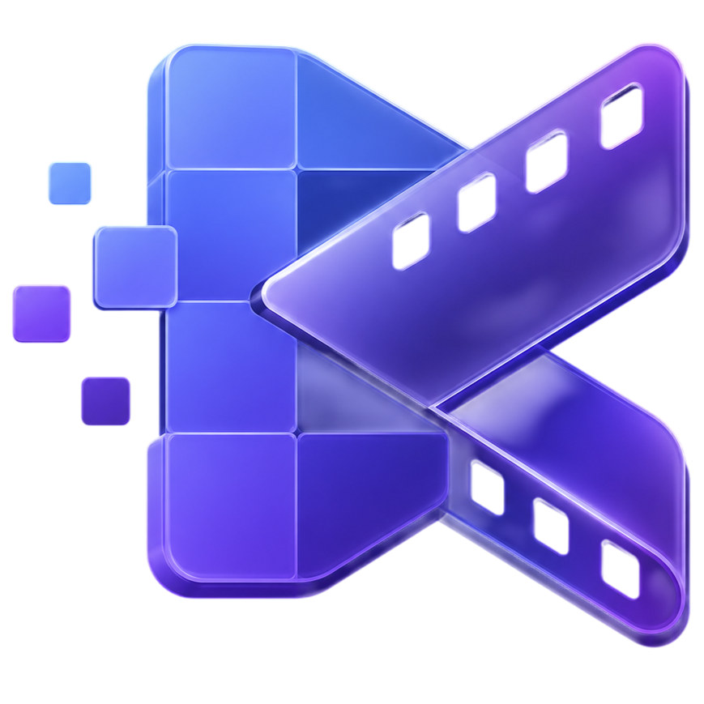
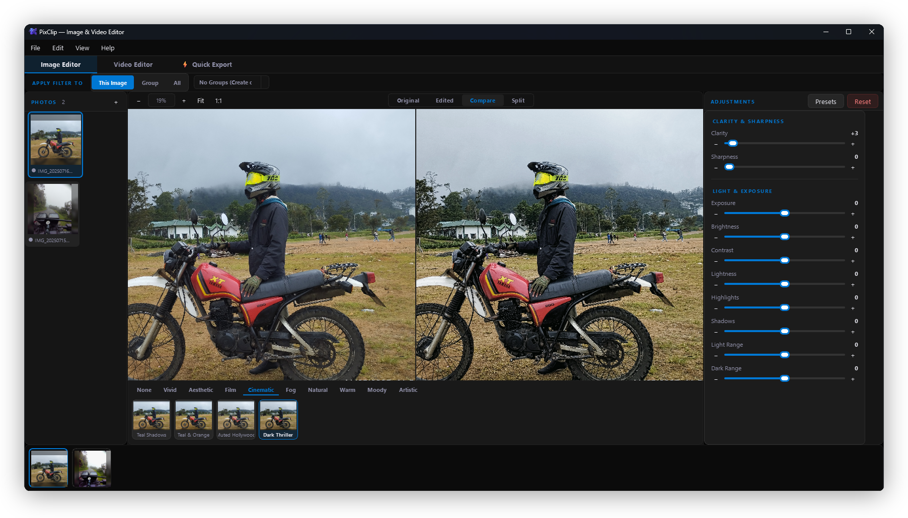
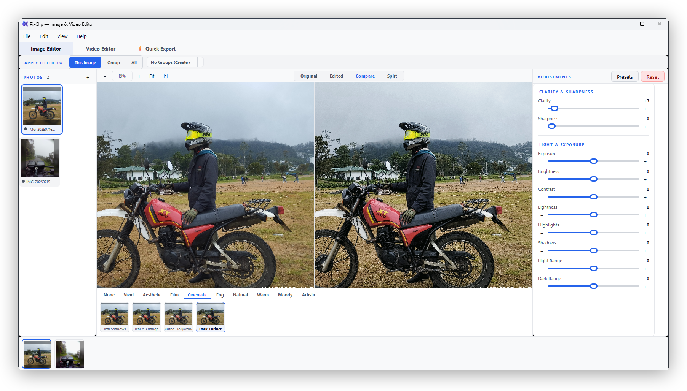

<div align="center">
  <a href="https://sourceforge.net/projects/pixclip/" target="_blank">
    
  </a>
  <h1>PixClip</h1>
  <p><strong>Simple, fast, and powerful image & video editor specializing in professional clarity, sharpness, and custom filters.</strong></p>

  [](https://sourceforge.net/projects/pixclip/files/latest/download)
  [](https://opensource.org/licenses/MIT)
  
  
  

  <p>
    <a href="https://sourceforge.net/projects/pixclip/" target="_blank">🚀 SourceForge</a> •
    <a href="#-features">✨ Features</a> •
    <a href="#-ui-themes">🎨 UI Themes</a> •
    <a href="#📦-getting-started">📦 Getting Started</a>
  </p>
</div>

---

## Application Preview

<video src="docs/media/videos/app-demo.mp4" width="100%" autoplay loop muted controls></video>

---

## ✨ Features

### 🔍 Specialized Clarity & Sharpness
* **Clarity Control**: Enhances local contrast using a bilateral filter to boost detail without halo artifacts.
* **Edge Sharpness**: Uses unsharp masking with a noise threshold to sharpen details without amplifying grain.
* **Precision Processing**: Computes all adjustments using 32-bit floating-point arrays to avoid color banding.
* **Perceptual Color Space**: Adjusts lightness, contrast, and clarity in LAB space to preserve natural hues.

### 🎥 Native Video Filtering & Export
* **Video Adjustments & LUTs**: Apply clarity, sharpness, color adjustments, and 3D LUT filters directly to video files.
* **Fast FFmpeg Export**: Translates parameters directly into native FFmpeg filtergraphs for 10-50x faster hardware-accelerated video compile speeds.

### 🛠️ User Workflow
* **Built-in Presets**: Over 30 preloaded filters across 9 creative families (Vivid, Film, Cinematic, Warm, Moody, etc.) for instant one-click styling.
* **LUT Engine**: Generates and applies 3D LUTs (`.cube` format) dynamically for color-grading.
* **Real-Time Previews**: Downscales viewport feeds for instantaneous feedback during slider adjustments.
* **Configurable Grid**: Set sidebar asset thumbnails to show 1, 2, or 3 items per row.

---

## 🎨 UI Themes

PixClip features a premium custom-styled desktop interface with support for both Dark and Light themes.

**Dark Mode (Default)**


<details>
  <summary>🔍 View Light Theme</summary>
  <br>
  
</details>

---

## 📦 Getting Started

### Prerequisites
* **Python 3.9+**
* **FFmpeg**: Required for video preview and exporting. Place the `ffmpeg.exe` executable inside the `ffmpeg/` folder (or ensure it is added to your system `PATH`).

### Setup & Run
1. Install package dependencies:
   ```bash
   pip install -r requirements.txt
   ```
2. Launch the application:
   ```bash
   python main.py
   ```
   *Optional: Pass media files as arguments to open them instantly:*
   ```bash
   python main.py image.jpg video.mp4
   ```

---

## 🤝 Support & Contributing

If you find PixClip helpful, please consider **giving it a ⭐ star** on our [SourceForge Project Page](https://sourceforge.net/projects/pixclip/) to support its development! Contributions of all kinds are welcome.

---

<div align="center">
  Made with ❤️ for creative editors.
</div>
